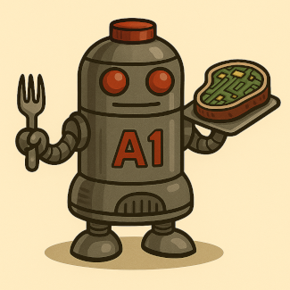

# 🥩 MEAT

**Mitt Enhanced Application Toolkit**  



Minimal reactive state system with plugin support, Vue composables, and zero dependencies.


---

## 🍖 Features

- Reactive state via `meat.set()` / `meat.get()`
- Scoped listeners and wildcard events
- DOM syncing with `linkToDOM()`
- Zero dependencies
- Plugin architecture via `.use()`
- Vue 3 composables
- LocalStorage persistence

---

## 📦 Install

```bash
npm install @lucianofpereira/meat
# or
yarn add @lucianofpereira/meat
```

Basic usage:

```ts
import meat from 'meat';
meat.set('theme', 'dark');
```

---

## 🔌 Plugin Support

```ts
meat.use(pluginFn); // Load MEAT-enhancing logic
```

Examples:

- `logState.js` adds `meat.logState()` using `console.table()`
- `meatVuePlugin.js` enables `$meat` globally in Vue apps

Composables:

```ts
const theme = useMeat('theme'); // Vue reactive ref
```

---

## 📚 Docs Overview

| Page | Description |
|------|-------------|
| [README](./docs/README.md) | Feature overview |
| [Getting Started](./docs/Getting-Started.md) | Setup tutorial |
| [Architecture](./docs/architecture.md) | Internal design flow |
| [Plugins](./docs/plugins.md) | Writing MEAT plugins |

### 🔧 Framework Integrations

| Page | Framework |
|------|-----------|
| [Alpine](./docs/alpine.md) | Alpine.js |
| [Angular](./docs/angular.md) | Angular |
| [Astro](./docs/astro.md) | Astro |
| [Nuxt](./docs/nuxt.md) | Nuxt |
| [Next](./docs/next.md) | Next.js |
| [React](./docs/react.md) | React |
| [Qwik](./docs/qwik.md) | Qwik |
| [Solid](./docs/solid.md) | Solid |
| [Svelte](./docs/svelte.md) | Svelte |
| [Vue](./docs/vue.md) | Vue |

### 🧪 Examples & Tests

- [`examples/`](./examples/) — MEAT demos for every framework  
- [`test/`](./test/) — Unit tests for all plugin integrations

---

## 🧪 Testing

```bash
npm test
```

Covers:
- Core event bus
- Plugin usage
- Vue reactivity

---

## 🛠 Contributing

Fork → branch → build → PR.  
See [`CONTRIBUTING.md`](./CONTRIBUTING.md) for setup tips and code style.

---

## 💬 Contact

**Author**: Luciano Federico Pereira  
💼 [LinkedIn](https://www.linkedin.com/in/lucianofedericopereira/)  
🐛 [GitHub Issues](https://github.com/lucianofedericopereira/meat/issues)

---

## 📜 License

Licensed under the [MIT License](./LICENSE) © 2025 Luciano Federico Pereira

---

> MEAT is hot, readable, and ready for your plate.

---

## 💛 Support MEAT

MEAT is maintained by [Luciano Federico Pereira](https://github.com/lucianofedericopereira).  
If you find it useful, consider sponsoring via:

- [Ko-fi](https://ko-fi.com/lucianofedericopereira)
- [Liberapay](https://liberapay.com/lucianofedericopereira)

Your support fuels open-source tools that are lean, clean, and reactive-driven. 🐮🔥
